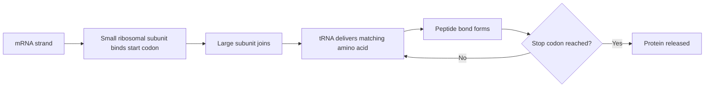
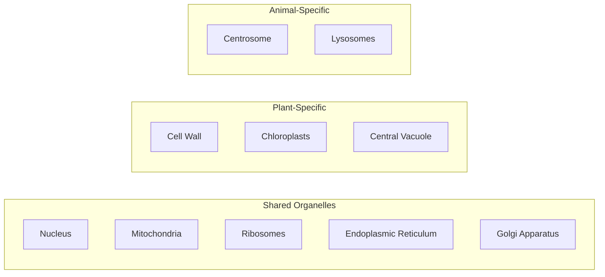

# SPL Run: build_concept_book

- **Adapter:** claude_cli
- **Model:** claude-sonnet-5
- **Tokens:** 23140 in / 13869 out
- **Latency:** 522983ms
- **Timestamp:** 2026-09-27 13:11:40

## Output

```output


---

## Eukaryotic Cell

A eukaryotic cell is defined by one structural fact: its genetic material is enclosed inside a membrane-bound nucleus. That single feature separates eukaryotes — all plants, animals, fungi, and protists — from prokaryotes (bacteria and archaea), whose DNA sits free in the cytoplasm with no enclosing membrane. Eukaryotic cells are also larger, typically 10–100 micrometers across, roughly ten times the diameter of a typical bacterial cell.

The nucleus is the first example of a strategy the eukaryotic cell uses throughout its interior: partitioning itself into separate membrane-bound compartments, each with its own internal chemistry, so that processes that would otherwise interfere with each other can proceed at the same time. Keeping DNA inside the nucleus shields replication and transcription from the mechanical activity of the cytoplasm. The rest of the cell's interior — mitochondria, the endoplasmic reticulum, the Golgi apparatus, lysosomes, and, in plants and algae, chloroplasts — is organized on this same principle, each compartment dedicated to a different job: energy production, protein assembly, digestion, or photosynthesis. You will study each of these compartments individually later; what matters here is the pattern — one job, one enclosed compartment, one internal environment.

Consider a pancreatic cell producing insulin, a protein hormone. If the cell had no internal compartments, insulin would have to be built and released in the same open space that holds the cell's DNA. Instead, the gene is transcribed inside the nucleus, and the resulting instructions leave the nucleus to be built, processed, and packaged in a sequence of other compartments before the finished hormone is released from the cell. Each compartment completes one step and passes the product to the next.

This handoff structure is directly testable. If a researcher chemically blocks the transfer between two compartments in the pathway, the partly finished protein accumulates at that blocked step and never reaches the next one. Because each compartment does one distinct job, blocking it stalls only the stage downstream of it — and the location of the buildup tells you exactly where the pathway broke. Once you know which compartment performs which job, you can predict, and diagnose, the effect of disrupting any single step in the sequence.

---

## Plasma Membrane

Every cell, whether bacterial or human, is enclosed by a plasma membrane — a thin, flexible barrier that defines the cell's boundary and controls what enters or leaves. The membrane's structure is described by the fluid mosaic model: a phospholipid bilayer embedded with proteins that can drift laterally within the layer, like icebergs floating in a fluid sea. Each phospholipid molecule has a hydrophilic ("water-loving") phosphate head and two hydrophobic ("water-fearing") fatty acid tails. Because cells exist in watery environments both inside and out, phospholipids spontaneously arrange into a bilayer — heads facing outward toward water, tails facing inward away from it. This self-assembly is driven by simple chemistry: hydrophobic tails minimize contact with water, while hydrophilic heads maximize it, and no energy input from the cell is required.

Embedded within this lipid bilayer are proteins that carry out most of the membrane's active work. Integral proteins span the bilayer and often form channels or carriers for transporting specific molecules, such as glucose or ions, that cannot cross the hydrophobic core unassisted. Peripheral proteins attach loosely to one surface and often function in cell signaling or structural support. Cholesterol molecules interspersed among the phospholipids help regulate membrane fluidity, preventing it from becoming too rigid at low temperatures or too fluid at high ones.

Consider a practical problem: a drug developer wants to design a molecule that enters cells to treat a disease. Small, nonpolar molecules like oxygen or steroid hormones diffuse directly through the lipid bilayer because they are compatible with the hydrophobic core. But a polar or charged drug, such as a sugar analog or an ion-based compound, cannot cross unaided — it requires an embedded transport protein or must be redesigned to mimic a molecule recognized by an existing channel. This is why membrane structure directly informs pharmacology: predicting whether a drug is membrane-permeable, or whether it needs a delivery mechanism like a liposome carrier (itself built from phospholipids), depends on matching molecular polarity to the properties of the bilayer.


*Cross-section of the plasma membrane showing the phospholipid bilayer with hydrophilic heads facing outward and hydrophobic tails forming the core, along with an embedded protein channel spanning both layers.*

---

## Vesicle And Vacuole

A vesicle is a small, membrane-bound sac that buds off from one organelle to carry its contents to another location in the cell. A vacuole is the same basic structure — a fluid-filled sac enclosed by a single membrane — but larger and longer-lived, built for storage rather than short-range shuttling. Because both are made of a lipid bilayer, whatever they carry stays chemically separated from the surrounding cytosol, and because their membranes are compatible with the membranes they meet, they can fuse with other structures to release or exchange material. Think of vesicles and vacuoles as the same basic container used two ways: as a delivery truck (vesicle) or as a warehouse (vacuole).

Vesicles are the cell's internal shipping containers. When a protein is made in the rough endoplasmic reticulum, it is packaged into a transport vesicle that buds off the ER membrane, travels to the Golgi apparatus, and fuses with it to deliver its cargo. The Golgi then modifies the protein and packages it into a new vesicle bound for the plasma membrane, for secretion outside the cell, or for one of the cell's specialized digestive sacs, which break down worn-out organelles or engulfed material using the same fusion mechanism. Because delivery and fusion are targeted, the cargo never leaks into the cytoplasm in transit.

Vacuoles specialize in holding rather than moving material. A mature plant cell typically has one large central vacuole occupying up to 90% of cell volume, storing water, ions, sugars, and pigments. Its internal water pressure pushes outward against the cell wall, keeping the plant rigid; when the vacuole loses water, that pressure drops and the plant wilts.

Problem-solving application: if a biologist sees a plant cell with a shrunken vacuole and cytoplasm pulled away from the cell wall, they can infer the cell was placed in a solution more concentrated than its interior, so water left the vacuole by osmosis. A swollen vacuole pressing firmly against the wall indicates the opposite — a more dilute surrounding solution driving water in. Vacuole size and shape is therefore a direct, observable proxy for the osmotic conditions a cell has experienced.

---

## Dna

Deoxyribonucleic acid (DNA) is the molecule that stores and transmits genetic information in every living cell. It is a double-stranded polymer built from four types of nucleotides, each composed of a deoxyribose sugar, a phosphate group, and one of four nitrogenous bases: adenine (A), thymine (T), guanine (G), and cytosine (C). The two strands wind around each other in a double helix, held together by hydrogen bonds between complementary base pairs — A pairs with T (two hydrogen bonds), and G pairs with C (three hydrogen bonds). This complementarity is the chemical basis for both accurate replication and reliable information storage: knowing the sequence of one strand tells you the sequence of the other.

Organization differs sharply between the two domains of cellular life. In prokaryotes (bacteria and archaea), DNA typically exists as a single circular chromosome located in a nucleoid region, not enclosed by a membrane, often supplemented by small circular plasmids that can carry extra genes such as antibiotic resistance. In eukaryotes, DNA is linear, divided among multiple chromosomes, and packaged tightly around histone proteins into chromatin, all enclosed within a membrane-bound nucleus. This packaging is not just for storage efficiency — it also regulates which genes are accessible for transcription at a given time.

Worked example: A double-stranded DNA segment reads 5′-ATG CGT ACA-3′ on one strand. Using the base-pairing rule, the complementary strand, read 3′ to 5′, is TAC GCA TGT — or written conventionally in the 5′→3′ direction, TGT ACG CAT. This antiparallel, complementary relationship is exactly what DNA polymerase relies on during replication, and what primers and probes rely on in techniques like PCR.

Problem-solving application: Suppose a bacterial genome sample is contaminated with plasmid DNA, and you need to distinguish the two using a restriction enzyme digest and gel electrophoresis. Because the chromosome is one large circular molecule and plasmids are much smaller circles, cutting both with the same enzyme and running the fragments on a gel lets you separate them by size — smaller plasmid fragments migrate farther. Recognizing that prokaryotic genomes are organized as circular DNA (unlike the linear, chromatin-packaged DNA of eukaryotes) is essential to correctly interpreting the banding pattern and designing the experiment.

---

## Ribosome

A ribosome is a molecular machine that synthesizes proteins by reading the sequence of a messenger RNA (mRNA) strand and linking amino acids together in the order it specifies. Ribosomes are found in every living cell — bacteria, archaea, and eukaryotes alike — reflecting their status as one of the most ancient and essential pieces of cellular machinery. Structurally, a ribosome is built from two subunits, one large and one small, each assembled from RNA and protein. In eukaryotic cells, ribosomes sit free in the cytoplasm or dock onto the endoplasmic reticulum, giving that organelle its "rough" appearance; in prokaryotic cells, which lack membrane-bound organelles, ribosomes simply float in the cytoplasm.

Consider a ribosome translating the codon sequence AUG-GGC-UUU on an mRNA strand. The small subunit binds the mRNA and scans to the start codon (AUG), which signals "begin here" and specifies methionine. As each codon is read in turn, a matching tRNA delivers its amino acid — GGC brings glycine, UUU brings phenylalanine — and the ribosome forms a peptide bond linking it to the growing chain before shifting one codon down the strand. This cycle repeats until a stop codon is reached and the finished protein is released.

This process illustrates a practical problem-solving skill: given an mRNA sequence and the genetic code table, you can predict the exact amino acid sequence of the resulting protein — a task performed routinely in molecular biology and biotechnology labs, for example when engineering a bacterium to produce a therapeutic protein like insulin. A single mRNA strand can also be translated by several ribosomes at once, so a cell can produce many copies of the same protein in parallel, which is valuable when a protein is urgently needed, such as during an immune response.


*Diagram of the ribosome's translation cycle, from mRNA binding to release of the finished protein.*

---

## Cell Wall

The cell wall is a rigid, semi-permeable layer that lies external to the plasma membrane in plants, fungi, most protists, and nearly all bacteria (but not animal cells). Its primary jobs are mechanical: it resists the inward push of water so the cell doesn't burst, it locks the cell into a fixed shape, and it provides the structural support that lets plants stand upright without a skeleton. The wall lets water, ions, and small solutes pass through freely on their way to the membrane, but its rigidity means the cell cannot change shape the way an animal cell can.

Composition differs by organism: plant walls are built mainly from cellulose, a polysaccharide of glucose chains that bundle into tough fibers; fungal walls use chitin, the same nitrogen-containing polysaccharide found in insect exoskeletons; bacterial walls are made of peptidoglycan, a mesh of sugar chains cross-linked by short peptides. That last detail has a direct medical payoff — penicillin-class antibiotics work by blocking the enzymes that cross-link peptidoglycan, so the bacterial wall fails and the cell bursts.

Worked example: place a plant cell in a solution with a lower solute concentration than the cytoplasm. Water moves in by osmosis, and the plasma membrane pushes outward against the wall. Because the wall won't stretch, pressure builds inside the cell until it balances the inward pull of water — this equilibrium pressure is called turgor pressure, and it's what keeps a lettuce leaf crisp rather than limp. Now reverse the solutions: put the cell in a bath with a higher solute concentration. Water leaves the cytoplasm, the plasma membrane shrinks away from the wall, and fluid fills the space between them — yet the wall itself keeps its original shape and size the entire time. That last point is the key evidence: the wall and membrane are mechanically independent structures.

Problem-solving application: a wilted plant regains firmness minutes after watering because its cells rebuild turgor pressure against walls that never lost their shape. A wilted animal tissue sample, lacking that rigid scaffold, cannot recover the same way — rehydrating the cytoplasm does nothing to restore a shape the tissue no longer has a template for. The cell wall, in short, is what lets turgor pressure do useful mechanical work.

---

## Central Vacuole

Nearly every mature plant cell contains a central vacuole, a single membrane-bound sac that can occupy 30–90% of the cell's interior volume. This large, fluid-filled compartment gives plant cells a structural and functional toolkit unlike anything found in animal cells. It performs three interconnected jobs: it stores water, dissolved ions, sugars, pigments, and waste products; it generates turgor pressure, the outward push of the vacuole's contents against the cell wall that keeps the cell rigid; and it drives cell expansion during growth by taking up water and stretching the cell wall outward.

Turgor pressure explains why unwatered plants wilt. When water is abundant, the vacuole draws in water because its interior holds a higher concentration of dissolved solutes than the surrounding cytoplasm, and water moves toward the more concentrated solution. As water enters, the vacuole swells and presses the cell's contents firmly against the rigid cellulose wall, much like air pressure holding up an inflated tire. When water is scarce, the vacuole loses water, turgor pressure drops, and the cell — and the tissues built from many such cells — go slack, producing the visible droop of a thirsty plant.

Consider a worked scenario: a horticulturist notices that a houseplant's leaves have gone limp overnight despite normal watering the day before. Testing shows the soil is dry. Watering the plant restores leaf firmness within a few hours. The explanation is straightforward: without water available in the soil, the roots cannot keep pulling water up into the plant, so vacuoles throughout the leaf lose water and turgor pressure falls. Once water becomes available again, the vacuoles refill, restoring internal pressure and leaf rigidity.

This same mechanism underlies plant growth strategy. Because building a large water-filled vacuole is cheaper than building an equivalent volume of dense cytoplasm, plants can achieve rapid, low-cost cell enlargement by pumping solutes into the vacuole and letting water follow — a process central to how seedlings elongate quickly with minimal biomass investment. This trade-off — growth via cheap water storage rather than costly cytoplasmic synthesis — is a defining feature of how plants, unlike most animal cells, achieve size.

<figure class="cb-figure">
  
  <figcaption>Plant cell structure highlighting the central vacuole relative to the cell wall and cytoplasm. Source: <a href="https://commons.wikimedia.org/wiki/File:Plant_cell_structure_svg.svg">Plant cell structure svg</a>, Wikimedia Commons, public domain.</figcaption>
</figure>

---

## Centrosome

The centrosome is the primary microtubule-organizing center of animal cells, usually positioned just next to the nucleus. It is built from two small cylindrical structures surrounded by a protein-rich region that nucleates new microtubules — filaments that radiate outward like spokes from a hub. Because nearly all of a cell's microtubules originate from this one structure, the centrosome effectively sets the internal routing system of the cell, the tracks along which vesicles, organelles, and eventually chromosomes travel.

Consider what happens as a cell prepares to divide. During interphase the single centrosome copies itself, and the two resulting centrosomes move to opposite ends of the cell as mitosis begins. Each one radiates its own array of microtubules, and together the two arrays form the two poles of the spindle apparatus that pulls the cell's duplicated chromosomes apart. Fibers extending from each pole attach to the duplicated chromosomes, and the balanced, opposing pull from the two poles is what lets each daughter cell end up with one full, matched set of chromosomes. If the centrosome fails to duplicate correctly or migrate to the correct position, the spindle assembles unevenly, raising the risk that a daughter cell receives too many or too few chromosomes.

This connects directly to a practical diagnostic application: centrosome number is used in practice as a marker of genomic instability. Many cancer cells contain three, four, or more centrosomes instead of the normal one or two, and each extra centrosome pulls chromosomes toward it during division, so the resulting daughter cells end up with unbalanced, abnormal chromosome counts. Pathologists can stain centrosomal proteins and count centrosomes per cell under a microscope; an elevated count in a tumor biopsy is a recognized indicator of chromosomal instability and is studied as a possible predictor of how aggressively a cancer will progress. Understanding how the centrosome duplicates and organizes the spindle therefore provides a mechanistic link between a single organelle's behavior and a measurable, clinically relevant feature of cancer progression.


*The centrosome duplication cycle and its role in building a balanced spindle for cell division.*

---

## Chloroplast

The chloroplast is the organelle in plant and algal cells responsible for photosynthesis — the conversion of light energy into the chemical energy stored in glucose. Like the mitochondrion, it is enclosed by a double membrane and carries its own circular DNA and ribosomes, a legacy of its origin as a free-living cyanobacterium engulfed by an ancestral eukaryotic cell roughly 1.5 billion years ago, the same endosymbiotic origin that explains mitochondrial ancestry.

What makes the chloroplast structurally distinct is a third internal membrane, the thylakoid, folded into flattened, stacked sacs and bathed in a surrounding fluid. Photosynthesis unfolds in two connected stages tied to this layout. Embedded in the thylakoid membrane, chlorophyll and its accessory pigments absorb light and use that energy to split water molecules ($2H_2O \rightarrow O_2 + 4H^+ + 4e^-$), releasing oxygen and producing ATP and NADPH. Those energy carriers then diffuse into the surrounding fluid, where carbon dioxide is captured and built, step by step, into glucose.

Worked example: A greenhouse grower notices that plants under red-blue LED light grow faster than under green light alone. Chlorophyll absorbs red and blue wavelengths strongly but reflects green light — which is why leaves appear green. Since absorbed light drives the water-splitting, ATP-generating step, green-dominant light supplies less usable energy, slowing sugar production and overall growth. This explains the grower's observation directly from chloroplast pigment chemistry.

Problem-solving application: If a herbicide blocks electron transport in the thylakoid membrane, predict the immediate effect on both stages of photosynthesis. Because ATP and NADPH production would halt, sugar synthesis in the surrounding fluid — despite happening in a separate compartment — would also stop, since it depends entirely on those two products. This illustrates a key exam-style reasoning skill: tracing how a disruption in one part of the chloroplast cascades into a spatially separate but chemically dependent process.

---

## Lysosome

A lysosome is a membrane-bound organelle in animal cells that functions as the cell's recycling and waste-disposal center. Its interior is maintained at a pH of about 4.5–5.0, far more acidic than the surrounding cytosol (pH ~7.2), and it is packed with roughly 50 different hydrolytic enzymes — proteases, lipases, nucleases, and glycosidases — that break covalent bonds in proteins, lipids, nucleic acids, and complex carbohydrates. These enzymes are acid hydrolases: they work best in an acidic environment, which is a built-in safety feature. If a lysosome ruptures and spills its contents into the neutral-pH cytosol, the enzymes largely shut down, protecting the rest of the cell from self-digestion. The acidic interior is maintained by proton pumps embedded in the lysosomal membrane that actively transport H⁺ ions in, using ATP.

Lysosomes perform three main jobs. First, in intracellular digestion, they break down macromolecules brought in by endocytosis (e.g., a cell absorbing nutrients) so the resulting monomers can be reused. Second, in autophagy, a lysosome fuses with a vesicle containing a damaged or worn-out organelle — for instance, a mitochondrion that has stopped functioning efficiently — and degrades it, recycling its components into new molecules. Third, in phagocytosis, immune cells such as macrophages engulf invading bacteria into a phagosome, which then fuses with a lysosome; the resulting acidic, enzyme-rich compartment (a phagolysosome) destroys the pathogen.

Consider a white blood cell that has just engulfed a bacterium. The phagosome membrane fuses with one or more lysosomes, delivering hydrolases and lowering the internal pH. Proteases dismantle the bacterial cell wall proteins, nucleases degrade its DNA, and lipases break down its membrane lipids into fatty acids and glycerol, which the immune cell can later reuse for energy or membrane synthesis.

This system also explains certain diseases: in Tay-Sachs disease, a single lysosomal enzyme (hexosaminidase A) is missing due to a genetic mutation, so a specific lipid accumulates undegraded in neurons, causing progressive nerve damage. This illustrates a general problem-solving principle in cell biology: a defect in even one lysosomal enzyme can block an entire degradation pathway, since these enzymes typically act in a stepwise sequence rather than interchangeably.


*Sequence of events in lysosomal digestion of an engulfed pathogen.*

---

## Prokaryotic Cell

A prokaryotic cell is the structurally simplest form of life: a single-celled organism whose genetic material floats freely in the cytoplasm rather than being enclosed in a nucleus, and which lacks the membrane-bound organelles found in more complex cells. Bacteria and archaea are the two domains built entirely from prokaryotic cells. Despite this simplicity, prokaryotes are metabolically diverse and occupy nearly every environment on Earth, from boiling hydrothermal vents to the human gut. Structurally, a typical prokaryotic cell consists of a plasma membrane enclosing the cytoplasm, ribosomes that manufacture proteins, a single loop of DNA carrying all of the cell's genetic instructions, and usually a rigid outer wall that gives the cell its shape and protects it from bursting. Many prokaryotes also have external structures that help them move or attach to surfaces.

**Worked example.** Suppose you examine a cell under a light microscope: it is roughly 2 micrometers long, shows no visible internal compartments, and splits into two identical cells every 20 minutes under ideal conditions. You suspect it is prokaryotic. The small size, rapid division rate, and absence of any internal membrane-bound structures are all consistent with a prokaryotic cell — but no single feature is sufficient on its own, since a fragment of a eukaryotic cell or a stray organelle could also be small and lack visible compartments. Confirming the identification would require a further test of its DNA arrangement or cell-wall chemistry.

**Problem-solving application.** Because a prokaryotic cell has no nucleus separating its DNA from the rest of the cytoplasm, its machinery for reading genetic instructions and building proteins operates as one continuous process, without the extra step of moving instructions out of a nuclear compartment first. Biotechnologists exploit this directly: when a human gene is inserted into a bacterium such as *E. coli* to mass-produce a protein like insulin, the bacterium's own protein-making machinery reads and acts on the new instructions almost immediately, with no compartment boundary to cross. Recognizing whether a cell is prokaryotic is therefore not just a classification exercise — it determines which techniques for gene insertion, large-scale protein production, or antibiotic treatment will actually work, since these methods rely on structural features unique to cells that lack a nucleus.

---

## Plant Vs Animal Cell Structures

Both plant and animal cells are eukaryotic: each has a nucleus, mitochondria, ribosomes, and an endomembrane system (endoplasmic reticulum and Golgi apparatus) that manufacture and route proteins. What distinguishes them is a small set of specialized organelles tied to each organism's lifestyle. Plants are stationary and make their own food, so their cells carry structures for support and photosynthesis. Animals move, hunt, and digest other organisms, so their cells carry structures for flexibility and intracellular digestion.

Plant cells are built around one defining feature: a rigid cell wall made of cellulose fibers, positioned just outside the plasma membrane. This wall gives the cell a fixed shape and lets it push back against incoming water pressure, so the cell fills with water and stays firm rather than swelling until it bursts — this is why a well-watered plant stands upright while a wilted one goes limp. Two other structures support the plant's lifestyle: chloroplasts, which contain chlorophyll and convert light energy into the chemical energy (glucose) the plant runs on, and a large central vacuole that stores water, nutrients, and waste and, together with the wall, keeps non-woody tissue rigid.

Animal cells lack a wall, so the plasma membrane alone bounds the cell — this is what allows animal cells to change shape for movement, muscle contraction, and tissue folding during development. Two organelles reflect this animal-specific lifestyle: the centrosome, which coordinates the even splitting of genetic material when a cell divides, and lysosomes, membrane-bound sacs of digestive enzymes that break down worn-out cell parts, engulfed food, and invading pathogens.

A useful problem-solving approach: given a micrograph or cell description, identify which organelles are present and absent, then infer the organism's biology. A cell with a thick outer wall, a large fluid-filled sac, and green organelles must be autotrophic (self-feeding) and structurally rigid — a plant cell. A cell lacking a wall but containing enzyme-filled sacs near a nucleus preparing to divide is likely an animal cell actively engaged in digestion or division. This same organelle-to-function reasoning is used to interpret real electron micrographs in a lab setting.


*Comparison of eukaryotic organelles shared by plant and animal cells versus those unique to each cell type.*

---

## Payoff

Every concept in this book — membranes, organelles, energy conversion, genetic control — converges here, in the comparison between a plant cell and an animal cell. This is the natural endpoint because it is the first place where structure, function, and evolutionary history are visible together in a single, testable observation. Put a leaf cell and a cheek cell side by side under a microscope, and the differences you see — a rigid cell wall, a large central vacuole, chloroplasts — are not arbitrary. Each one is a direct architectural answer to a different way of life: a plant that cannot move and must build its own food from sunlight, versus an animal that moves, hunts, or grazes, and consumes food already made. Understanding this comparison means you can now read a cell's structure and infer its function, rather than memorizing a list of parts.

This payoff is what makes the concept practically useful, not just descriptive. A botanist inspecting crop tissue for turgor loss during drought is applying exactly this framework: no central vacuole to maintain pressure, no rigidity, no upright growth. A physician examining a tissue biopsy for abnormal cell shape relies on knowing what animal cells normally lack — no wall, no chloroplast — so that any unexpected structure signals disease or contamination. A biotechnologist engineering algae to overproduce biofuel precursors is manipulating chloroplast density and cell wall composition, structures that only make sense once you understand why plant cells evolved them in the first place. In each case, the underlying skill is the same one this concept teaches: use structural evidence to predict, or explain, cellular function.

Problem-solving with this concept means asking, given an unfamiliar cell image or dataset, "What can the presence or absence of a wall, a vacuole, or a chloroplast tell me about how this cell lives?" That question scales from a classroom microscope slide to a research lab's electron micrograph.

From here, choose a direction to go deeper: examine how cell wall composition determines a plant's response to water stress, or how the loss of normal cell architecture serves as an early diagnostic marker in pathology. Either path turns this comparison from a memorized diagram into a working investigative tool.
```
