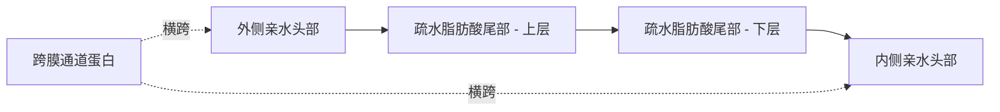
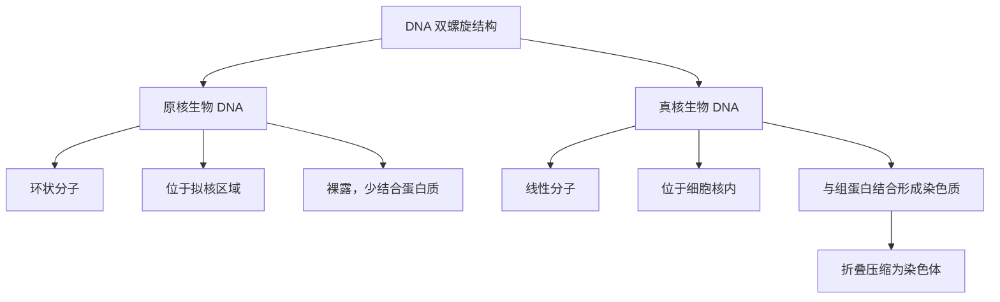
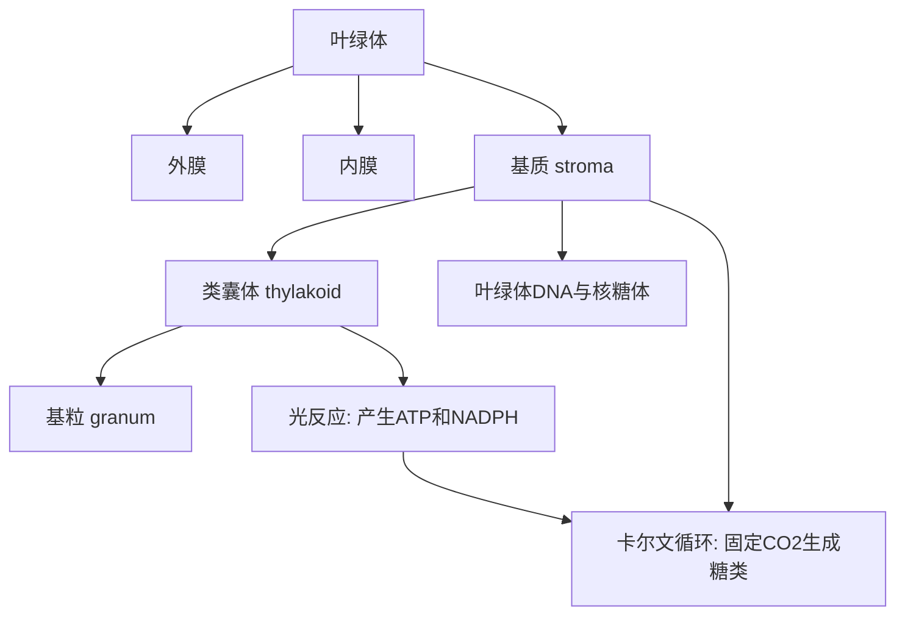
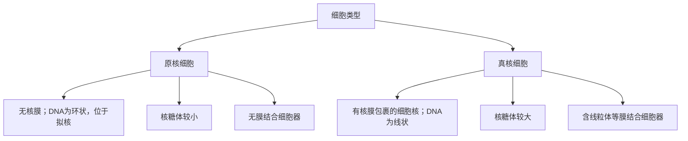
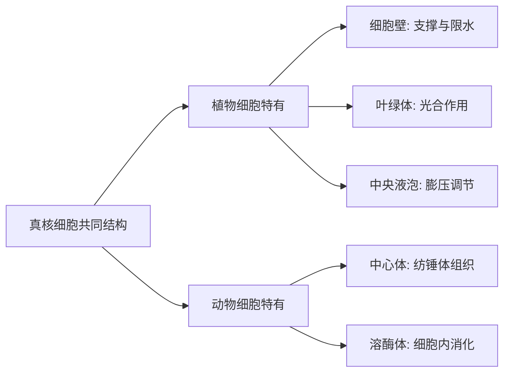

# SPL Run: build_concept_book

- **Adapter:** claude_cli
- **Model:** claude-sonnet-5
- **Tokens:** 14263 in / 3442 out
- **Latency:** 316949ms
- **Timestamp:** 2026-09-27 20:44:57

## Output

```output


---

## Eukaryotic Cell

真核细胞是指含有膜结合细胞核的细胞。"真核"（eukaryote）一词源自希腊语，意为"真正的核"——这一核心特征将其与原核细胞（细菌和古菌）区分开来：原核细胞的遗传物质裸露地漂浮在细胞质中，没有核膜包裹。真核细胞是动物、植物、真菌以及原生生物的基本结构单位。除细胞核外，真核细胞的细胞质中还分布着其他多种膜结合细胞器（如线粒体、内质网、高尔基体等），它们各自承担专门的代谢功能，使不同的化学反应能够在相对独立的环境中进行、互不干扰；这些细胞器各自的具体结构与功能，将在后续章节中分别展开介绍。

**结构与功能**：细胞核由双层核膜包裹，膜上分布着核孔，允许RNA和蛋白质选择性地进出，从而将DNA的储存与基因表达的调控严格限定在核内。这层物理隔离，正是真核细胞相比原核细胞能够实现更精细基因调控的关键：原核细胞的DNA直接暴露在细胞质中，转录与翻译几乎同步发生；而真核细胞可以先在核内完成RNA的加工（如剪接），再将其运出核外进行翻译，为基因表达增添了一层调控节点。

**问题解决应用**：假设你在显微镜下观察一个未知细胞样本，发现其体积明显大于典型细菌细胞（细菌通常为1–10微米，该样本可达10–100微米），且内部可见一个被膜包裹的深色圆形结构。你可以据此判断该细胞为真核细胞——判断的关键依据并非体积本身，而是是否存在核膜包裹的细胞核；体积增大只是伴随特征，因为容纳这层膜结构需要更大的空间。若样本体积较大却未见任何膜包裹结构，则应先怀疑染色或制片存在问题，重新确认后再下结论，而不是仅凭体积草率归类。这种"先确认核膜是否存在，再考虑其他线索"的判断顺序，正是区分原核细胞与真核细胞最直接、最可靠的方法。

真核细胞借助核膜实现的这层分隔，是其能够演化出更精细代谢调控与更复杂细胞结构的基础；细胞质中其他细胞器如何在此基础上进一步分化出各自的功能，将是后续内容展开的重点。

---

## Plasma Membrane

细胞膜（质膜）是包裹细胞、将其内部环境与外界分隔开的一层薄膜，主要由磷脂双分子层构成，其中镶嵌着多种蛋白质。每个磷脂分子都有一个亲水性的"头部"（含磷酸基团，可与水分子形成氢键）和两条疏水性的"尾部"（脂肪酸链，排斥水分子）。当大量磷脂分子聚集在水环境中时，它们会自发排列成双层结构：亲水头部朝向细胞内外两侧的水性环境，疏水尾部则相互靠拢，藏在膜的中央，从而形成一道天然的屏障。这种自组装现象不需要能量输入，是分子间相互作用（热力学上趋向能量最低状态）的自然结果。

细胞膜并非静止不变的墙壁，而是一种流动的结构——磷脂分子和蛋白质可以在膜平面内侧向移动，这一特性被称为"流动镶嵌模型"（fluid mosaic model）。镶嵌在膜中的蛋白质承担着多种功能：通道蛋白允许特定离子或分子通过，载体蛋白负责主动或被动运输，受体蛋白识别细胞外的信号分子（如激素），还有一些蛋白质参与细胞间的识别与黏附。

**应用实例**：考虑水分子与葡萄糖分子穿过细胞膜的差异。水分子体积小、极性弱，可以通过膜上的水通道蛋白（水通道蛋白，aquaporin）快速扩散；而葡萄糖分子较大且极性强，无法直接穿过疏水核心，必须依赖专门的载体蛋白（如GLUT转运蛋白）才能进入细胞。这解释了为什么细胞膜被称为"选择透过性膜"——它并非对所有物质一视同仁，而是根据分子大小、极性和是否存在对应转运蛋白来决定通透性。理解这一点，有助于解释诸如肾小管重吸收、神经细胞动作电位产生等生理过程的分子基础。


*磷脂双分子层横截面示意图：亲水头部朝向膜两侧的水环境，疏水尾部藏于中央，蛋白质通道贯穿整个膜结构，为特定分子提供通路。*

---

## Vesicle And Vacuole

**定义**

囊泡（vesicle）和液泡（vacuole）都是由单层磷脂双分子膜包裹形成的细胞内囊状结构，主要功能是物质的储存与运输。两者结构相似，区别主要在于大小和特化程度：囊泡通常较小（直径约50–1000纳米），数量多，动态性强，负责在细胞内不同区室之间穿梭运输蛋白质、脂质等分子；液泡则体积更大（在植物细胞中可占细胞体积的90%以上），数量少甚至只有一个中央大液泡，功能更为专一和持久，如储存水分、营养物质、色素，或调节细胞内的渗透压。可以把囊泡想象成工厂里的"运货小推车"，把液泡想象成仓库里的"大型储物罐"——前者流动性强、任务多变，后者相对固定、专门存储。

**实例解析**

以植物细胞为例：细胞通过渗透作用吸水后，水分主要储存在中央液泡中，液泡膜（tonoplast）内外的溶质浓度差产生膨压（turgor pressure），使细胞保持坚挺，这也是植物茎叶挺立不倒的物理基础。与此同时，高尔基体（Golgi apparatus）不断"出芽"产生分泌囊泡，将加工好的蛋白质包裹起来，沿细胞骨架轨道运输到细胞膜，通过膜融合方式将内容物释放到细胞外——这一过程称为胞吐（exocytosis）。囊泡完成"一次性投递"任务后即被回收利用，而液泡则长期维持细胞的稳态。

**问题解决应用**

理解二者差异有助于分析实际生物学问题。例如，若某突变导致液泡膜上的水通道蛋白（水孔蛋白，aquaporin）失活，细胞将无法有效调节渗透压，膨压下降，植物会出现萎蔫现象——这正是许多耐旱基因工程研究的靶点。又如，胰岛细胞分泌胰岛素依赖分泌囊泡的胞吐过程，若囊泡运输机制（如驱动蛋白 kinesin 沿微管移动）出现障碍，会导致激素分泌延迟，这与某些代谢性疾病的机制研究直接相关。因此，判断一个结构应归为囊泡还是液泡，不仅是形态学分类问题，更关系到推断其在物质运输、渗透调节或分泌通路中的具体角色。

---

## Dna

脱氧核糖核酸（DNA，deoxyribonucleic acid）是几乎所有细胞用来储存遗传信息的分子。DNA 由两条互补的核苷酸链组成，通过碱基互补配对原则反向平行盘绕成双螺旋结构：腺嘌呤（A）与胸腺嘧啶（T）以两个氢键配对，鸟嘌呤（G）与胞嘧啶（C）以三个氢键配对。这种配对规则不仅赋予 DNA 稳定性，也是其能够精确复制、忠实传递遗传信息的化学基础——子链的碱基序列完全由模板链决定。

不过，DNA 在原核生物和真核生物中的组织方式截然不同。原核生物（如细菌）的 DNA 通常是一个环状分子，游离于细胞质中的"拟核"区域，没有膜包被，长度较短，且很少与蛋白质结合。真核生物（如动植物细胞）的 DNA 是线性的，储存在细胞核内，并与组蛋白紧密缠绕形成染色质，进一步压缩折叠成染色体，这样才能把长达数米的 DNA 塞进直径仅几微米的细胞核。

**应用实例**：假设某双链 DNA 片段一条链的序列为 5'-ATGCCGTA-3'，其互补链应为 3'-TACGGCAT-5'（书写为 5'→3' 方向则为 5'-TACGGCAT-3'）。这种互补性正是 PCR（聚合酶链式反应）技术和基因测序引物设计的基础：只要知道一条链的序列，就能推断出互补链，从而设计出能特异性结合目标片段的探针或引物。

**解决问题**：科学家如何判断一段未知 DNA 来自原核生物还是真核生物？可通过观察其组织形式——环状且无组蛋白结合提示原核起源；线性且与组蛋白共同构成染色质结构则提示真核起源。这一判断原则被广泛应用于宏基因组学分析和进化关系推断中。


*该图展示了 DNA 在原核生物与真核生物中不同的组织方式及其结构层级。*

---

## 核糖体

核糖体（ribosome）是存在于所有细胞（包括细菌、古菌和真核细胞）中的分子机器，负责将信使RNA（mRNA）携带的遗传信息翻译成蛋白质。它由核糖体RNA（rRNA）和多种蛋白质组成，分为大、小两个亚基：真核细胞的核糖体为80S（由60S大亚基和40S小亚基组成），原核细胞的核糖体为70S（由50S大亚基和30S小亚基组成）。核糖体既可以游离于细胞质中合成细胞内使用的蛋白质，也可以附着在内质网上（形成粗面内质网），合成分泌蛋白或膜蛋白。

**工作实例**：翻译开始时，小亚基先与mRNA结合，识别起始密码子AUG；携带甲硫氨酸的起始tRNA与之配对后，大亚基随即结合，形成完整核糖体。核糖体内部有三个关键位点——A位（氨基酸位）、P位（肽键位）和E位（排出位）。核糖体沿mRNA每移动一个密码子（3个核苷酸），就催化相邻氨基酸之间形成肽键，肽链随之延伸一个氨基酸残基，直到遇到终止密码子（UAA、UAG或UGA），肽链释放，核糖体解离。这一过程平均每秒可添加约2–20个氨基酸，具体速率因物种和细胞状态而异。

**问题解决应用**：假设一个蛋白质由300个氨基酸组成，其对应的mRNA编码区（不含起始和终止密码子）应含有多少个核苷酸？由于每个氨基酸对应一个三联体密码子，编码区长度为：
$$
300 \times 3 = 900 \ \text{个核苷酸}
$$
加上起始密码子（3个）和终止密码子（3个），完整的开放阅读框共需906个核苷酸。这类计算在分子生物学和基因工程中很常见，例如设计引物、预测蛋白质分子量，或判断突变（如插入/缺失）是否会导致移码，从而破坏下游的正确翻译。理解核糖体的工作机制，也是抗生素（如链霉素、红霉素，它们分别靶向细菌的30S和50S亚基）作用原理的基础——这正是选择性抑制细菌而不伤害人体细胞的关键，因为真核与原核核糖体在结构上存在显著差异。

---

## 细胞壁

细胞壁（cell wall）是位于质膜外侧的一层坚韧结构，存在于植物细胞、真菌细胞、大多数原核生物（细菌）以及部分原生生物中，但动物细胞没有细胞壁。它的主要功能包括：为细胞提供机械支撑、维持固定形状、抵抗渗透压变化引起的破裂，并在多细胞生物中为组织提供整体结构强度。植物细胞壁的主要成分是纤维素（一种由葡萄糖单体构成的多糖），此外还含有半纤维素和果胶；真菌细胞壁则主要由几丁质构成；细菌细胞壁的核心成分是肽聚糖。这种化学组成的差异，正是许多抗生素（如青霉素）能够选择性攻击细菌而不伤害人体细胞的原因——因为人体细胞根本没有细胞壁。

**举例说明**：把一个植物细胞放入清水（低渗溶液）中，水会因渗透作用进入细胞，质膜向外膨胀，但细胞壁会像一个坚固的外壳一样限制细胞过度扩张，使细胞达到"膨压"（turgor pressure）状态而不会破裂。这正是新鲜蔬菜挺立、植物茎叶保持坚挺的原因。相反，如果将同一细胞放入高浓度盐水（高渗溶液）中，水会流出细胞，质膜从细胞壁上收缩脱离，这种现象称为质壁分离（plasmolysis），此时细胞壁的形状保持不变，但细胞本身已萎蔫。

**问题解决应用**：细胞壁的存在解释了许多实际现象。例如，为什么切开的黄瓜放入盐水中会变软？因为盐水造成高渗环境，水从细胞中渗出，细胞失去膨压，即使细胞壁结构未被破坏，整株组织也会因内部细胞萎蔫而变软。又例如，在显微镜下区分植物细胞与动物细胞的一个关键判据，就是观察细胞外围是否存在一层清晰、僵硬的边界结构——若有，则为细胞壁而非仅仅是质膜。理解细胞壁的存在与成分，还能帮助解释农业中植物萎蔫、木材硬度、以及细菌细胞壁如何成为抗生素设计的靶点等一系列跨学科问题。

<figure class="cb-figure">
  
  <figcaption>植物细胞结构示意图，可见细胞壁位于质膜外侧，包围整个细胞。Source: <a href="https://commons.wikimedia.org/wiki/File:Plant_cell_structure_svg_no_lignin.svg">Wikimedia Commons</a>, CC BY-SA 3.0.</figcaption>
</figure>

---

## Central Vacuole

中央液泡是植物细胞中体积最大的细胞器,成熟细胞中其体积可占细胞总体积的 30% 以上，有时甚至高达 90%。它被一层称为液泡膜（tonoplast）的单层膜包裹，内部充满细胞液（cell sap），其中溶解了水、无机盐、糖分、色素、代谢废物以及少量蛋白质。中央液泡承担三项核心功能：调节细胞内水分与溶质浓度、通过膨压支撑细胞壁、以及驱动细胞的不可逆扩张生长。

**水势与膨压的关系**：液泡液中溶质浓度较高，使细胞的渗透势降低，水因此持续从周围环境经渗透作用进入液泡。水的流入使液泡膨胀，向外挤压细胞质和细胞壁，产生膨压（turgor pressure）。膨压是维持植物茎叶挺立的关键——失水的植物萎蔫，正是因为液泡失水、膨压下降，细胞壁失去支撑力。可以把液泡想象成一个装满水的气球：气球内部的水压将气球壁绷紧，而细胞壁则像一层坚韧的网兜限制气球无限膨胀，两者共同作用形成稳定的细胞形态。

**驱动细胞扩张**：植物细胞的生长主要依靠液泡吸水膨大，而非依靠增加细胞质或细胞器数量，这种方式在能量上远比合成新的原生质更经济。当液泡膨压升高到一定程度，细胞壁中的纤维素微纤丝会在特定酶（如膨胀素，expansin）作用下局部松弛，使细胞壁在膨压推动下沿着阻力最小的方向不可逆地伸展，从而实现细胞体积的净增大。这一过程是幼苗伸长、根尖延伸区细胞生长的主要机制。

**问题解决应用**：若将一株萎蔫的植物浇水后重新变得挺拔，说明液泡通过渗透作用重新吸水、膨压恢复。反之，若把新鲜蔬菜浸泡在高浓度盐水中，蔬菜会变软——因为液泡失水（渗透作用使水外流），膨压丧失，细胞壁不再受到内部支撑。理解这一原理可以解释腌制、脱水保鲜等常见食品处理过程，也说明了为什么过度施肥（土壤盐分过高）会导致植物根部细胞失水甚至死亡。

---

## Centrosome

中心体（centrosome）是动物细胞中位于细胞核附近的微管组织中心，负责启动和调控细胞内微管网络的组装。每个中心体通常由一对相互垂直排列的中心粒（centriole）构成，外周包裹着致密的蛋白质基质，称为周中心粒物质（pericentriolar material, PCM）。真正负责微管成核的并不是中心粒本身，而是PCM中富含的γ-微管蛋白环形复合物（γ-tubulin ring complex），它为微管的"负极端"提供模板，使微管能够以中心体为起点、以恒定的方向向细胞外周延伸。

细胞分裂间期，中心体协助维持细胞骨架的整体构型，决定细胞器的空间定位、细胞极性以及纤毛的形成基础。进入有丝分裂前，中心体完成复制，一分为二，两个子中心体分别迁移到细胞的两极，成为纺锤体（spindle apparatus）两极的组织核心。由此发出的纺锤丝精确捕获并牵引染色体，保证遗传物质在两个子细胞间均等分配。

以人体细胞为例：一个即将分裂的成纤维细胞在S期完成DNA复制的同时，其中心体也完成复制——原有的一对中心粒各自在旁边"生出"一个子中心粒，形成两对中心粒。到G2期末，两个中心体已分离并各自携带一对中心粒，为分裂做好准备。若用秋水仙素（colchicine）等药物抑制微管聚合，纺锤体将无法正常形成，染色体便无法准确分离，细胞分裂随之受阻——这正是此类药物被用作抗癌化疗手段的原理，也说明了中心体功能异常与染色体不稳定性、肿瘤发生之间的关联。

在解决实际问题时，理解中心体的功能有助于解释一系列细胞生物学现象：例如，为什么某些神经细胞和肌肉细胞（终末分化、不再分裂）中心体会逐渐退化；为什么中心体数目异常（如一个细胞中出现两个以上中心体）常见于癌细胞并导致多极纺锤体和染色体错误分配；以及纤毛相关遗传病（纤毛病，ciliopathy）为何常与中心粒结构缺陷相关，因为中心粒也是纤毛基体（basal body）的来源。

<figure class="cb-figure">
  
  <figcaption>中心体结构示意图，展示成对垂直排列的中心粒与周围的微管组织基质。Source: <a href="https://commons.wikimedia.org/wiki/File:Centrosome_(borderless_version).svg">Wikimedia Commons</a>, Public Domain.</figcaption>
</figure>

---

## Chloroplast

叶绿体是植物细胞和藻类细胞中的一种细胞器，是光合作用发生的场所。它拥有双层膜结构：外膜通透性较高，内膜则严格调控物质进出。内膜以内是基质（stroma），其中悬浮着一叠叠圆盘状的类囊体（thylakoid），这些类囊体像硬币一样堆叠成基粒（granum）。类囊体膜上嵌有叶绿素等光合色素，负责吸收光能并启动光反应；基质中则进行卡尔文循环（Calvin cycle），利用光反应产物将二氧化碳固定为糖类。值得注意的是，叶绿体拥有自己的环状DNA和核糖体，能够独立合成部分蛋白质——这一特征是内共生学说（endosymbiotic theory）的关键证据：叶绿体很可能起源于被古老真核细胞吞噬后保留下来的光合细菌。

**实例分析**：观察一片菠菜叶的横切面，叶肉细胞中可见大量椭圆形、呈绿色的颗粒，这些就是叶绿体，通常每个细胞含有几十到上百个。光合作用的总反应可概括为：
$$6CO_2 + 6H_2O + \text{光能} \rightarrow C_6H_{12}O_6 + 6O_2$$
这一反应实际分为两个阶段在叶绿体的不同部位完成：光反应在类囊体膜上产生ATP、NADPH和氧气；暗反应（卡尔文循环）在基质中利用ATP和NADPH将CO₂转化为葡萄糖。

**问题解决应用**：若某植物长期处于弱光环境，其叶片细胞会如何调整叶绿体？答案是：细胞通常会增加叶绿体数量或增大类囊体膜面积，以提高光能捕获效率，这也解释了为什么阴生植物的叶片往往更薄、叶绿体密度更高、叶绿素含量更多，从而在有限光照下最大化光合效率。理解叶绿体的结构与功能关系，有助于解释农业实践中光照管理、遮阴处理对作物产量的影响。


*该图展示叶绿体的内部结构层次及光合作用两阶段在不同区域的分工。*

---

## 溶酶体

溶酶体（lysosome）是动物细胞中的一种膜结合细胞器，内部含有约60多种水解酶，能够分解蛋白质、脂类、多糖和核酸等大分子。这些酶统称为酸性水解酶，因为它们只有在酸性环境（pH约4.5-5.0）中才能发挥最佳活性，而细胞质基质的pH接近中性（约7.2）。这种pH差异是一种保护机制：即使溶酶体膜偶然破裂，泄漏出的少量酶在中性的细胞质中也几乎不具活性，从而避免细胞自身被消化。溶酶体膜本身则依靠膜蛋白上高度糖基化的保护层，防止被内部的酶降解。

溶酶体由高尔基体的反面网络以出芽方式产生，其中的水解酶最初在粗面内质网上合成，经甘露糖-6-磷酸标记后被准确分拣运送至此。

溶酶体承担三项核心功能。第一，细胞内消化：通过胞吞作用摄入的营养颗粒、细菌等被包裹进囊泡后与溶酶体融合，酶将其分解为氨基酸、单糖等可被细胞重新利用的小分子。第二，自噬作用：衰老或受损的细胞器（如线粒体）被双层膜包裹形成自噬体，随后与溶酶体融合并被降解，实现细胞成分的循环利用，这一过程在细胞应对饥饿或清除损伤结构时尤为关键。第三，防御病原体：白细胞（如巨噬细胞）通过吞噬作用摄入细菌后，吞噬体与溶酶体融合形成吞噬溶酶体，病原体在其中被水解酶分解并清除。

一个具有临床意义的问题解决情境是遗传性溶酶体贮积症。例如泰-萨克斯病（Tay-Sachs disease）患者由于基因突变缺失一种特定水解酶（氨基己糖苷酶A），导致神经细胞中某类脂质无法被分解，逐渐堆积于溶酶体内，最终损害神经系统功能。理解溶酶体的分解通路，有助于解释为何单一酶的缺陷会导致特定底物的选择性堆积，而不影响其他物质的正常代谢——这正是酶的底物特异性在细胞层面的直接体现，也是设计酶替代疗法等治疗策略的生物学基础。

---

## Prokaryotic Cell（原核细胞）

**定义**

原核细胞是细菌（Bacteria）和古菌（Archaea）这两大生命域的基本组成单位，结构简单、通常为单细胞生物。它最核心的特征是**没有核膜包被的细胞核**：遗传物质——通常是一条环状 DNA——直接盘绕在细胞质中一个称为**拟核（nucleoid）**的区域，没有膜将其与周围细胞质隔开。原核细胞同样缺乏线粒体、内质网、高尔基体等膜结合细胞器。尽管结构看似简单，原核生物在代谢方式上却极为多样，能够在强酸、高温、高盐甚至无氧的极端环境中生存。

**结构要点与实例分析**

以大肠杆菌（*E. coli*）为例：细胞外层由细胞壁和细胞膜包裹，起维持形态和保护作用；细胞质中散布的核糖体明显小于真核细胞的核糖体，负责合成蛋白质。由于遗传物质裸露在细胞质中、没有核膜阻隔，原核细胞的转录与翻译几乎可以同步进行，这使其基因表达速度远快于真核细胞，也是细菌种群能在数十分钟内完成一次分裂增殖的重要原因。

**问题解决应用**

拟核结构直接决定了原核细胞对某些药物的敏感性，这一点在解释抗生素的选择性作用时尤为关键。许多抗生素（如青霉素）通过破坏细菌特有的细胞壁合成，或结合细菌较小的核糖体来阻断蛋白质合成；而人体细胞（真核细胞）没有细胞壁，核糖体结构也不同，因此不会受到这些药物的影响。这正是抗生素能"精准打击"细菌而不伤害宿主细胞的结构基础——理解原核细胞与真核细胞在细胞壁、核糖体等结构上的差异，是设计新型抗菌药物、选择合适分子靶点时首先要考虑的问题。


*图示：原核细胞与真核细胞在核结构、DNA形态、核糖体大小及细胞器方面的主要差异对比。*

---

## Plant Vs Animal Cell Structures

植物细胞与动物细胞都是真核细胞,拥有细胞核、线粒体、内质网和高尔基体等共同细胞器,但二者在结构上存在几处关键差异,这些差异直接反映了各自的生活方式——植物固定不动、自己合成食物;动物则需要移动、摄食并主动分解外来颗粒。

植物细胞特有的结构包括:细胞壁(cell wall),由纤维素构成,位于细胞膜外侧,提供机械支撑并限制细胞过度吸水膨胀;叶绿体(chloroplast),含叶绿素,是光合作用的场所,将光能转化为化学能;中央液泡(central vacuole),体积可占细胞总体积的90%以上,储存水分、离子和代谢废物,并通过渗透压变化维持细胞的膨压(turgor pressure),这是植物茎叶保持挺立的主要机制。动物细胞则拥有中心体(centrosome),内含两个互相垂直排列的中心粒,负责在细胞分裂时组织纺锤体微管,确保染色体准确分配;以及溶酶体(lysosome),内含多种水解酶,用于分解细胞内衰老的细胞器、吞噬进来的病原体或大分子物质,相当于细胞的"消化系统"。

**工作实例**:假设你在显微镜下观察到一个未知细胞,发现其外层有一层坚硬的方形轮廓,且细胞内有一个占据大部分空间的透明囊状结构。你可以推断这是植物细胞——方形轮廓来自细胞壁对细胞形状的固定作用,透明大囊即为中央液泡。若同一细胞中还能看到绿色颗粒状结构,则进一步确认为植物细胞的叶绿体。

**问题解决应用**:若某种除草剂的作用机制是抑制纤维素合成酶,推测该除草剂对植物细胞和动物细胞的影响是否相同?由于动物细胞本身没有细胞壁,该药物应对动物细胞几乎无直接毒性,但会使植物细胞因缺乏结构支撑而萎陷死亡——这正是许多选择性除草剂设计的基本原理,即利用植物细胞特有结构实现"只杀草不伤人"的靶向效果。


*该图展示植物细胞与动物细胞在共同真核结构基础上各自特有的三种关键细胞器及其主要功能。*

---

## Payoff

细胞是生命的基本结构与功能单位,而植物细胞与动物细胞的比较,正是理解这一原理的收官之作。经过前面各章对细胞膜、细胞核、线粒体等细胞器的逐一学习,我们现在能够把这些零散的知识整合成一幅完整的图景:动物细胞依靠柔性的细胞膜维持形态,依赖线粒体供能,通过溶酶体分解废物;植物细胞则在此基础上,额外拥有坚固的细胞壁、负责光合作用的叶绿体,以及占据细胞大部分体积、调节渗透压与储存物质的中央液泡。理解这些异同,不仅是记忆结构名称,更是掌握"结构决定功能"这一贯穿生物学始终的核心逻辑——这正是本书选择它作为压轴概念的原因:它把细胞生物学的所有知识点收束成一个可以直接解释生命现象差异的统一框架。

这一比较框架具有极强的解释力,能够自然延伸到多个应用领域。在农业与植物科学中,理解细胞壁的成分(纤维素)与液泡的渗透调节功能,可以解释作物在干旱胁迫下的萎蔫机制,并指导灌溉与育种策略。在医学与药理学中,动物细胞缺乏细胞壁这一事实,正是青霉素类抗生素能够选择性杀死细菌(具有细胞壁)而不伤害人体细胞的根本原因,这一知识直接支撑抗生素的作用机制教学。在环境科学中,叶绿体驱动的光合作用是全球碳循环与氧气供给的基础,理解植物细胞结构有助于分析森林砍伐、藻类爆发等生态问题。在生物技术领域,细胞壁的存在与否决定了基因编辑或细胞融合实验中所需的预处理方法(如去壁形成原生质体),直接影响转基因作物或细胞培养的实验设计。

例如,若给定一株植物在盐胁迫下细胞液浓度升高、液泡体积变化的实验数据,你可以运用渗透压原理 $\pi = MRT$ 推算细胞的水势变化,并预测细胞是否会发生质壁分离——这正是结构知识转化为定量问题求解能力的体现。

现在,选择一个你最感兴趣的应用方向——无论是抗生素的选择性杀菌机制,还是转基因作物的细胞改造技术——深入探究细胞结构差异如何在真实世界的问题中发挥决定性作用。
```
